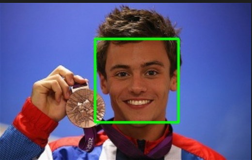

---
title: Midterm Report
layout: template
filename: MIDTERM.md
--- 
# CS 4641 Group 9: Midterm Report
## I. INTRODUCTION 

Recognition of emotions through software has been an area of research that has been rapidly growing over the past couple of years. With facial detection evolving and being integrated into everyday tasks such as unlocking your phone and using digital pay, it is time that facial recognition moves further but now in detecting emotions.  

Some of the past work that has already been done involves automatic detection of emotions in human photographs by Kosti (Kosti, 2019) and automatic detection using dual-channel expression learning algorithm by Song (Song, 2021) to improve forms of interpersonal communication through emotion recognition.  

Inspired by this, we wanted to replicate emotion detection through facial expressions and map them to Apple emojis as these emojis are a widely used form of communication online. We will be making use of the FEC dataset (Kosti, 2019) which is made up of about 156K labeled images. This variety of classified images was the foundation for our work and the initial basis for training our model. 

  

## II. PROBLEM DEFINITION 

If we want computers to be genuinely intelligent, adapt to us, and interact naturally with us, they will need the ability to recognize and express emotions (Picard, 2021). What seems like a fun project can impact several aspects of our lives.  

By mapping facial expressions to emojis, we will create a technology that benefits many institutions in the healthcare, gaming, security, and marketing industries, to mention a few. For example, a marketing and PR firm can use emotion detection to see how people react to a particular marketing campaign. It could also be useful for online learning to enable automatic tutors to provide better feedback for students according to their level of motivation or frustration (Kosti, 2019), and with online texting platforms to make communication more accessible to people with vision impairment. 

We need to bridge the gap between technology and humans, and emotion detection is a great way to do that. 

  

## III. DATA COLLECTION 

We initially sourced our dataset from R. Vemulapalli and A. Agarwala’s paper titled “A Compact Embedding for Facial Expression Similarity” (FES). At the time, we felt the Vemulapalli and Agarwala’s FES dataset was better for methods because the dataset is grouped in rows with the classification of ONE_CLASS_TRIPLET, SECOND_CLASS_TRIPLET and THREE_CLASS_TRIPLET representing scenarios where all images have one emotion, two images having one emotion in common and all the images having no emotion in common, respectively.  

For the data cleaning portion of the project, we began by performing feature selection on the dataset to identify rows of data that belonged to the ONE_CLASS_TRIPLET to enable us to identify the emotions in that class. We then created a Python script that would take the data presented in the compressed dataset and make it more compatible with our model. This involved downloading and saving thousands of images from the Internet, resizing the pictures to a common fixed height and width, and converting them to grayscale for easier and more accurate readings. 

After cleaning our new dataset, we pivoted to a new public dataset created by Johnathan Oheix, simply titled “Facial expression recognition dataset”. We decided to make this change because the Vemulapalli and Agarwala’s FES dataset did not assign labels to the images identifying what the emotion was, and manually assigning emotions to each datapoint was not feasible. This made it difficult to perform supervised learning on these images. The Johnathan Oheix dataset, however, groups pictures of emotions into the 7 major emotions: anger, disgust, fear, happiness, neutral, sad and surprised. 

  

*Figure 1: The Emotion Wheel*

  

## IV. METHODS 

So far, we have completely trained one model. That model uses supervised deep learning to detect emotions in the different images. It is largely based on a model used by Oheix, and is broken up into six layers; four convolutional layers that use 3x3 kernels and two fully connected layers.  

The model started with a learning rate of .001, but as the model’s validation loss flattened out, we reduced the learning rate. In addition, while we have the maximum number of training epochs as 50, we used callbacks to stop the training once the accuracy on the validation set plateaus to reduce overfitting. Because of this early stopping, the model trained in only 27 epochs. 

We began to implement facial detection using OpenCV and a Haar cascade classifier, however we quickly realized that this was not necessary for the current model. That being said, we have the groundwork for facial detection and tentatively plan to use it for future models and/or datasets. 

  

## V. RESULTS 

We started by detecting faces in pictures as shown below. 

 
  
*Figure 2: Our mode detecting a face from a soccer interview*

 
  
*Figure 3: Our model detecting a face of a medalist*

Overall, we were able to achieve these results with our facial detection: 

- Test-set size: 98 

- Accuracy: 74.48979% 

 

After training the Emotion detection Model for 27 epochs the validation accuracy was 66.24% with a validation loss of 1.0297. The loss and accuracy of the model of the validation set can be seen graphed with the respective values for the test set below. 

 
  
*Figure 4: Graphical representation of the loss and accuracy of our emotion recognition model*

  

## VI. DISCUSSION 

Haven completed data cleaning, facial detection and emotion recognition on human faces, we plan on moving on to classifying Apple emojis by their emotions. This will be the next step to achieving our goal of mapping human facial expressions to these emojis. 

While we initially planned on using supervised learning to achieve our final goal, we plan on spending some time doing more research on neural networks for the mapping process, as suggested in the feedback we received from the project proposal. We also plan on looking for easier and possible better ways of mapping human expressions to emojis other than feature extraction. 