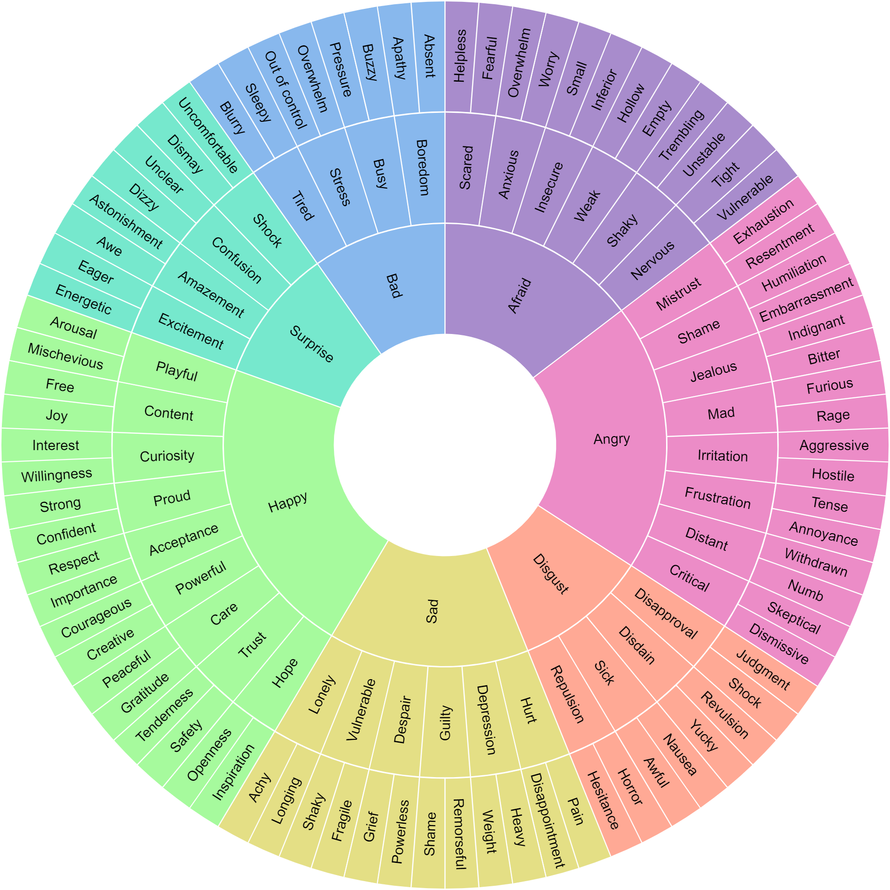
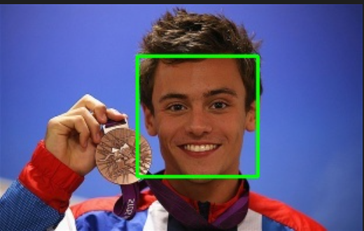
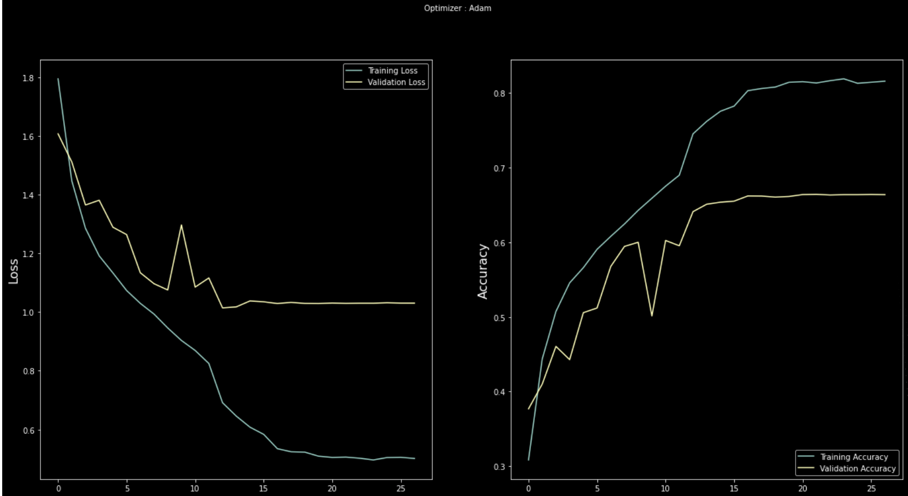
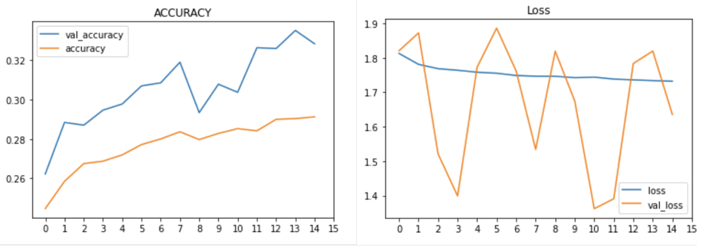
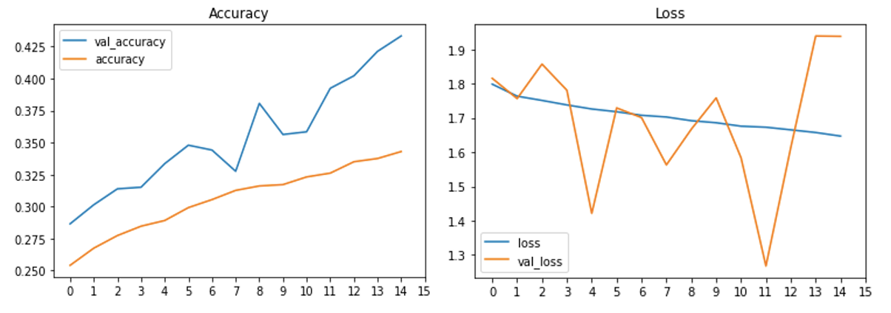
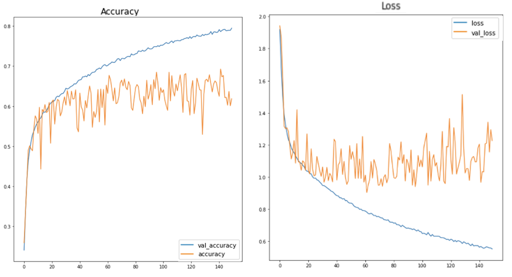
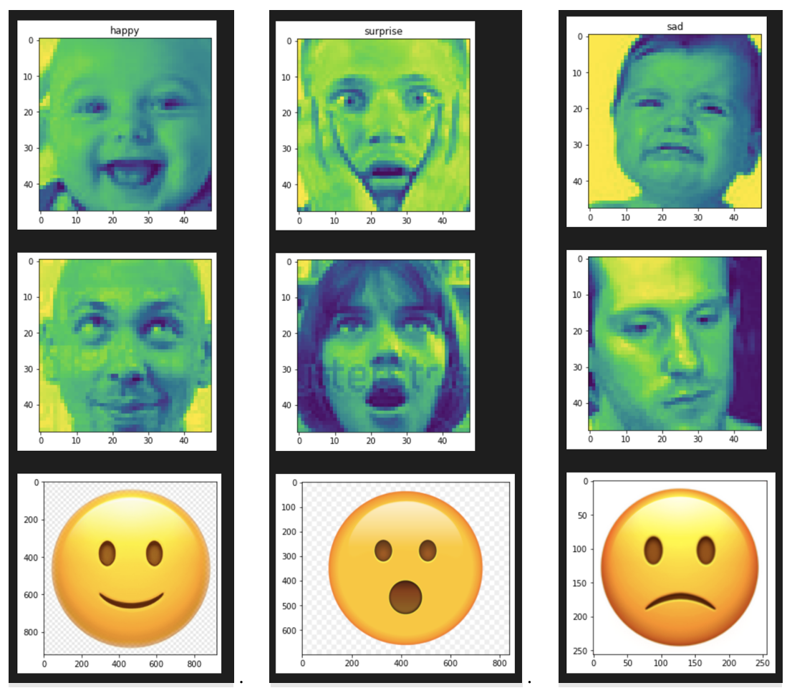
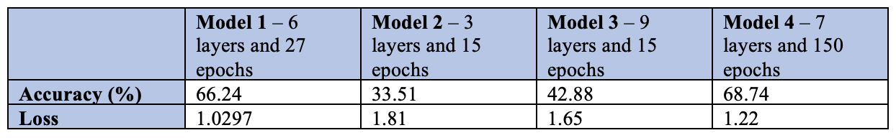
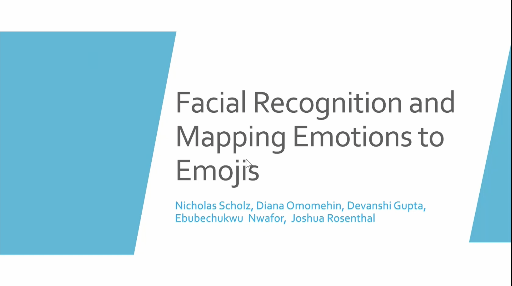

# CS 4641 Group 9: Final Report
## I.	INTRODUCTION
Recognition of emotions through software has been an area of research that has been rapidly growing over the past couple of years. With facial detection evolving and being integrated into everyday tasks such as unlocking your phone and using digital pay, it is time that facial recognition moves further but now in detecting emotions. 
Some of the past work that has already been done involves automatic detection of emotions in human photographs by Kosti (Kosti, 2019) and automatic detection using dual-channel expression learning algorithm by Song (Song, 2021) to improve forms of interpersonal communication through emotion recognition. 
Inspired by this, we wanted to replicate emotion detection through facial expressions and map them to Apple emojis as these emojis are a widely used form of communication online. Our main dataset for completing this project was the Johnathan Oheix dataset, which contained thousands of images all classified by the primary emotion displayed in them. This variety of classified images was the foundation for our work and the initial basis for training our model.

## II.	PROBLEM DEFINITION
If we want computers to be genuinely intelligent, adapt to us, and interact naturally with us, they will need the ability to recognize and express emotions (Picard, 2021). What seems like a fun project can impact several aspects of our lives. 
By mapping facial expressions to emojis, we will create a technology that benefits many institutions in the healthcare, gaming, security, and marketing industries, to mention a few. For example, a marketing and PR firm can use emotion detection to see how people react to a particular marketing campaign. It could also be useful for online learning to enable automatic tutors to provide better feedback for students according to their level of motivation or frustration (Kosti, 2019), and with online texting platforms to make communication more accessible to people with vision impairment.
We need to bridge the gap between technology and humans, and emotion detection is a great way to do that.

## III.	DATA COLLECTION
We initially sourced our dataset from R. Vemulapalli and A. Agarwala’s paper titled “A Compact Embedding for Facial Expression Similarity” (FES). At the time, we felt the Vemulapalli and Agarwala’s FES dataset was better for methods because the dataset is grouped in rows with the classification of ONE_CLASS_TRIPLET, SECOND_CLASS_TRIPLET and THREE_CLASS_TRIPLET representing scenarios where all images have one emotion, two images having one emotion in common and all the images having no emotion in common, respectively. 
 
For the data cleaning portion of the project, we began by performing feature selection on the dataset to identify rows of data that belonged to the ONE_CLASS_TRIPLET to enable us to identify the emotions in that class. We then created a Python script that would take the data presented in the compressed dataset and make it more compatible with our model. This involved downloading and saving thousands of images from the Internet, resizing the pictures to a common fixed height and width, and converting them to grayscale for easier and more accurate readings.
After cleaning our new dataset, we pivoted to a new public dataset created by Johnathan Oheix, simply titled “Facial expression recognition dataset”. We decided to make this change because the Vemulapalli and Agarwala’s FES dataset did not assign labels to the images identifying what the emotion was, and manually assigning emotions to each datapoint was not feasible. This made it difficult to perform supervised learning on these images. The Johnathan Oheix dataset, however, groups pictures of emotions into the 7 major emotions: anger, disgust, fear, happiness, neutral, sad and surprised. This made it easier to train and test our models to identify emotions displayed in visual media.

  
*Figure 1: The Emotion Wheel*

## IV.	METHODS AND DISCUSSION
To adequately test and tune our network, we built four convolutional neural networks. They all are conceptually similar, with all of them using supervised deep learning to detect emotions in the different images.
Our first model was largely based on the one used by Oheix with six layers; four convolutional layers that use 3x3 kernels and two fully connected layers. One of the key features of this model was that it started with a learning rate of .001, but as the model’s validation loss flattened out, we reduced the learning rate. In addition, while we have the maximum number of training epochs as 50, we used callbacks to stop the training once the accuracy on the validation set plateaus to reduce overfitting. Because of this early stopping, the model trained in only 27 epochs.
The second model, third model and fourth model have a similar structure to the first one. They all are fundamentally the same, being based on convolutional neural networks, but the number of layers were adjusted to 3, 9, and 7 respectively. We kept the learning rate the same at 0.001 across all four models.
In the second model, we decreased the number of epochs to 15 and it 2 convolutional layers and 1 fully connected layer. Our third model contained 9 layers involving four convolutional layers, 3 fully connected layers and 2 dropout layers. We also kept the learning rate the same at a rate of 0.001 to ensure consistency across all models. A variation with the number of models was also the number of epochs so the second model consisted of 15 epochs. Our fourth model contained 7 layers; four convolutional layers, 2 fully connected layers and 1 dropout layer. We wanted to see whether the model would perform better and reduce overfitting encountered in model 1 by adding in a dropout layer to avoid connecting all the features to the fully connected layers. 
Having these different models lets us choose a model that is not overfitting or underfitting to the training data.
The final step in completing the project was mapping the recognized facial expressions to apple emojis. In order to do this, we identified a few emojis that represented the major emotions as shown in the emotion wheel above (see Figure 1). Therefore, any emotion that was identified in an image was subsequently paired with the emotion identified in the image.

## V.	RESULTS 
### a.	Facial Detection
We started by detecting faces in pictures as shown below.
  
*Figure 2: Our mode detecting a face from a soccer interview*
  
*Figure 3: Our model detecting a face of a medalist*
 

Overall, we were able to achieve these results with our facial detection:  
Test-set size: 98  
Accuracy: 74.48979%

### b.	Emotion Recognition: Model #1, 6 Layers
After training the Emotion Detection Model for 27 epochs the validation accuracy was 66.24% with a validation loss of 1.0297. The loss and accuracy of the model of the validation set can be seen graphed with the respective values for the test set below.
   
*Figure 4: Graphical representation of the loss and accuracy of our first emotion recognition model*

### c.	Emotion Recognition: Model #2, 3 Layers – 2 convolutional layers and 1 fully connected layer
Accuracy- 33.51%  
Loss – 1.81

  
*Figure 5: Graphical representation of the loss and accuracy of our second emotion recognition model*

### d. Emotion Recognition: Model # 3, 9 layers – 4 convolutional, 3 fully connected and 1 dropout layers
Accuracy – 42.88%   
Loss - 1.65

  
*Figure 6: Graphical representation of the loss and accuracy of our third emotion recognition model*

### e. Emotion Recognition: Model # 4, 7 layers – 4 convolutional, 2 fully connected and 1 dropout layer
Accuracy – 68.74%  
Loss – 1.22

  
*Figure 7: Graphical representation of the loss and accuracy of our fourth and most accurate emotion recognition model*

### f.	Mapping to Apple Emojis
      
*Figure 7: facial expressions being mapped to Apple emojis*
Our results were as follows:
  

As we can see, there is a clear correlation between the number of layers and the number of epochs and the accuracy. As our data suggests, our ideal number of layers would be somewhere between 6-7 and our ideal number of epochs should range somewhere around 27-30. 

When we increased our layers, we also added different types of layers. In Model 3 and 4, we added dropout layers in addition to increasing the number of convolutional and fully connected layers. Dropout layers help reduce overfitting hence, we can see model 4 had the highest accuracy. If model 3 had higher number of epochs, we predict that the accuracy would have matched that of model 4. 

Also shown above are the successful results of our emoji-mapping from facial recognition. After we trained our model and identified emotions in our dataset (as shown in figure 7), we attempted to match 3 of the emotions identified to apple emojis and they were successfully matched.

## VI.	CONCLUSIONS

For our project, we created and tested an emotion recognition model that we varied with different number of layers and epochs. We found that accuracy increased with the number of layers and the number of epochs up to a certain point. As seen in model 1 with 27 epochs and 6 layers, we had an accuracy of 66.24% and a loss of 1.0297. Model 2 and model 3 were both trained with 15 epochs and 3 and 9 layers respectively. These resulted in accuracies of 33.51% and 42.88% with losses of 1.81 and 1.65 respectively. Hence, there was a clear correlation between the number of layers here. As we increased the number of layers, our accuracies increased. To look at the correlation between the number of epochs, we created model 4 which consisted of 7 layers and 150 epochs. Model 4 caused a slight increase in layers and a significant increase in the number of epochs. This model ended up having an accuracy of 68.74% and a loss of 1.22. 

Comparing all our models, it is evident that our model should be trained at around 6-7 layers and roughly 27-30 epochs. Out of all our models, model 4 performed the best with a 68.74% accuracy, followed by model 1 with a 66.24% accuracy.

After our models were trained, we were also successfully able to map our labelled images to appropriate apple emojis as shown in figure 7 (part d). Therefore, within the scope of our project, we were successful in achieving our goal. Reflecting on the project, we believe that our models would have performed better with 6-7 layers and the appropriate number of epochs as mentioned above. The layers must contain at least 4 convolutional layers, 2 fully connected layers and a dropout layer is optional. However, as seen with our results, our model 4 performed better with a dropout layer because it helped reduce overfitting. Therefore, our recommendation would be to include one in future emotion mapping models. 
A crucial way to improve our emotion recognition model would be to use the AlexNet architecture that is commonly used in deep learning models. The AlexNet utilizes 5 convolutional layers and three fully connected layers. It additionally applies ReLU after every layer. This reduces overfitting drastically and has a higher training accuracy overall. Hence application of known convolutional neural network architecture could have helped guide us in learning how many layers and what layers were needed to properly train our model. In the future, we would also include more emotions so we could map those emotions effectively to a wider range of apple emojis in order to achieve our final goal.

## Presentation Video
[Final Presentation](https://gtvault.sharepoint.com/:v:/s/CS4641312/EUHKsR63O6xIvQFcAC6CksABO4kCoB2OO9PbYLIW5hd2YA?e=FWsj1O)

## Works cited:
- https://www.educba.com/convolutional-neural-networks/
- https://en.wikipedia.org/wiki/AlexNet
- https://www.baeldung.com/cs/ml-relu-dropout-layers
